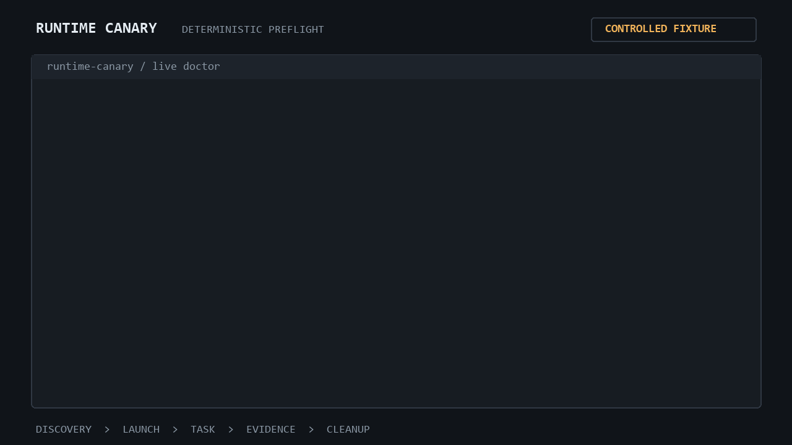

# Runtime Canary Launch Kit

Ready-to-use copy and assets for launching Runtime Canary. Keep claims aligned
with the checked-in product: Codex has a live adapter, Claude Code is probe-only,
and the deterministic fixture is development evidence rather than a real-agent
PASS.

## Core positioning

**Title**

Runtime Canary: Beyond `--version` for Coding Agents

**Slogan**

Deterministic canary checks & layer-by-layer failure attribution in isolated
sandboxes.

**GitHub description**

Beyond --version: deterministic, isolated pre-flight canary checks and failure
attribution for coding-agent runtimes.

**GitHub topics**

```text
coding-agents
ai-agents
canary-testing
preflight-check
runtime-diagnostics
developer-tools
codex
claude-code
mcp
model-context-protocol
sandboxing
typescript
nodejs
ci
```

## Visual asset



The GIF is generated from real deterministic CLI output:

```bash
python scripts/render-demo-gif.py
```

Regeneration requires Python 3 and Pillow. The rendered asset is checked in;
Runtime Canary users do not need Python or Pillow to run the product.

It deliberately shows a controlled fixture, not a fabricated real-agent
result. Suggested caption:

> `--version` passes. The live canary still catches and attributes a controlled
> configuration failure.

Chinese caption:

> `--version` 正常，不代表 Agent 真能工作。Live Canary 随即识别并归因了一个
> 受控配置故障。

## Channel drafts

- [Show HN](show-hn.md)
- [Reddit and X](reddit-and-x.md)
- [V2EX, 知乎与掘金](chinese-launch.md)
- [Newsletter submissions](newsletters.md)

## Truthful claim boundary

Safe claims:

- Five observable layers instead of the two visible through `--version`.
- Deterministic file evidence and explicit cleanup proof.
- Stable classification for authentication, network, permissions,
  configuration, timeout, evidence, and cleanup failures.
- Shareable JSON and Markdown omit raw output and local temporary paths.
- The packaged CLI passes an install-and-run smoke test.

Do not claim:

- MCP servers or custom skills are independently live-tested.
- Claude Code or Gemini CLI has a live adapter.
- A healthy real Codex environment has passed in every supported environment.
- Runtime Canary logs in, repairs credentials, or automatically fixes failures.
- Any guaranteed star count, conversion rate, or Trending placement.

## Launch checklist

- Confirm the default branch shows both language links and the GIF.
- Set the GitHub description and topics from this file.
- Open every command in the post against the current README.
- Use the GIF directly; do not upload a recompressed screenshot of it.
- Link to the repository once near the top and once at the end of long posts.
- Ask for technical feedback before asking for stars.
- Record the publication URL and date for each channel.
